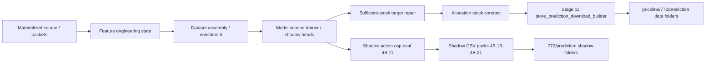

# Promotions data flow map (Phase 5A)

## Current flow (as-is)

## Where key concepts enter

| Concept | Introduced | Risk |
|---------|------------|------|
| Prediction date | `extraction_as_of_date` in enriched rows | Often after promo start in shadow eval rows |
| Pre-promo demand window | Partially in builder (`expected_units_before_promo_start`) | Not consistently in shadow packs until 4B.20/21 |
| Promo-period demand | `expected_promo_demand` / shadow demand | Often collapsed to 1 unit in legacy Stage 11 output |
| Day-one stock target | `target_SOH_at_promo_start`, `optimal_*` in old reports | Re-derived in 4B.20/21 scripts, not in production builder |
| End stock target | `floor_units_required`, 30-day cover logic | In model policy; weak in store CSV naming |
| Actuals | `actual_units_sold` in enriched parquet | Used for training/shadow review, not wired to live future packs |
| Action / order units | `allocation_stock_contract` + cap | Production vs shadow paths diverge |

## Where reports become stale or confusing

1. **Date mismatch:** Shadow packs (4B.13–4B.21) use promotions ending **April 2026**, while live priceline runtime has folders from **July 2026** onward. Store user cannot tell which pack matches live ordering.
2. **Path duplication:** `priceline/772/prediction`, `772/prediction`, mirror `shadow_review_*`, `store_action_pack_*`, `promotion_order_pack_*`, `commercial_promotion_reports_*` — six layers, no single index.
3. **Filename chaos:** UPPERCASE `STORE_ACTIONS_SHADOW.csv` vs lowercase `order_plan_all_skus.csv` vs `772_*_allocation-report-*.csv`.
4. **Column explosion:** Stage 11 allocation report ~600 columns; manager summary and feature inspection are audit-grade, not buyer-grade.
5. **Future vs completed:** 4B.21 correctly separates families but still uses **completed** promo dates for **future** order planning demo folders.
6. **Governance labels** repeated in every CSV but no single pack-level operating contract.

## Critical correction (Phase 5+)

**Live commercial order planning must anchor on promotions with start date ≥ 2026-06-20.**

Completed promotions belong only under `completed/<promo>/` for model-performance review when actuals exist.

## Stale artifacts (do not use for store action)

- `Diagnostics/phase4b*/` — engineering history
- `promotions/772/predictions/shadow_review_20260622_phase4b13/` — pilot review, superseded
- Shadow packs built from Feb–Apr 2026 promos — learning only, not live order planning

## Live production path (unchanged this phase)

`run_promotions_operational_cycle` → scoring → `store_prediction_download_builder` → `priceline/772/prediction/<run-date>/`

This path is **production-facing** but **not commercially coherent** without Phase 5B rewrite of the publisher layer.
